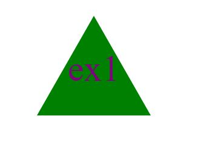

# Logo Generator

 

## Description
This generator will take in 3 parameters to create a simple logo, text, color and shape.  Logo is created by inputing your requirements into the terminal.

## Table of Contents
* [Description](#description)
* [Installation](#installation)
* [Usage](#usage)
* [Contribution](#contribution)
* [Test](#test)
* [Links](#links)
* [Questions](#questions)
* [Screenshot](#screenshot)
* [License](#license)

## Installation
You need to install Node to run the Logo Generator.

## Usage
To use, open a terminal in the index.js file, run "node index.js", answer the questions to creat your logo. A new index file will appear in the  file explorer on the left of VS code. Right click on that HTML file and open the HTML with a web browswer. There  you should see your logo in a web brower!

## Contribution
N/A

## Test
To test the shapes file, open Shapes.js, run NPM test.

## Questions
You can reach me with questions at Djanetod@hotmail.com.
GitHub: OliveraDiaz

## Links
Git: https://github.com/OliveraDiaz/LogoCreator.git Video walkthrough:

## Screenshot

